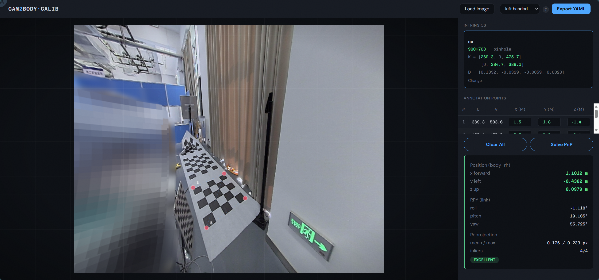

# cam2body-calib

Monocular camera-to-body extrinsics calibration: a few known 3D marker points → 6-DoF camera pose in the body/base_link frame.

It solves a Perspective-n-Point problem: given the camera intrinsics and a few 3D marker positions you measured on the vehicle, find where the camera is mounted and which way it points.

> 中文文档 → [README_zh.md](README_zh.md)

## Quick Start

```bash
uv run cam2body-calib ui
```

Opens a browser. The whole workflow happens there:

1. Upload camera intrinsics YAML (optional for viewing, required before solving)
2. Drop in a calibration image
3. Click the four corners of a marker on the image (right-click to undo)
4. Type in the 3D coordinates for each corner (meters, body frame)
5. Click Solve PnP
6. Pick an export profile (right-handed or left-handed), Export YAML



A reproducible example lives in `demo/` — intrinsics, image, and 3D coords included.

A CLI mode also exists if you prefer:

```bash
uv run cam2body-calib --image data/image.jpg --camera configs/camera.yaml
```

This opens an OpenCV window for manual corner annotation.

## Install

```bash
git clone https://github.com/ruali-dev/cam2body-calib.git
cd cam2body-calib
uv sync
```

Python 3.10+ required.

## Coordinate Frames

Body frame:

| Axis | Direction |
|------|-----------|
| X | Forward |
| Y | Left |
| Z | Up |

Right-handed by default. If your system uses y=right (left-handed), select `left_handed` when exporting and the tool handles the S@R@S conversion.

The PnP solver uses `solvePnPRansac`. One trap: the `tvec` it returns is the body origin in camera frame — not the camera position. The tool inverts this for you. Use `T_body_camera_link`.

## Judging Results

Two things matter: reprojection error and camera position.

| Mean Error | Verdict |
|-----------|---------|
| < 0.5 px | Solid |
| < 1.5 px | Decent |
| < 3.0 px | Borderline, try another image |
| > 3.0 px | Something's off — check intrinsics, 3D coords, annotations |

The camera position (x, y, z) should make physical sense. For orientation, look at the camera forward axis vector rather than staring at RPY numbers.

## Export Profiles

Two profiles available. Default is `left_handed` (x=fwd, y=right, z=up, yaw positive = right). For ROS, pick `right_handed` (x=fwd, y=left, z=up, yaw positive = left, REP-103 compatible).

Hover the `?` icon in the web UI to see what each profile does.

## Project Structure

```
cam2body-calib/
├── demo/                             # Reproducible example
│   ├── README.md                     # Steps + 3D coordinates
│   ├── intrinsics.yaml               # NE fisheye intrinsics
│   └── image.png                     # Calibration image
├── src/cam2body_calib/
│   ├── cli.py                        # CLI entry point
│   ├── web/                          # Web UI (FastAPI + frontend)
│   ├── estimation/                   # PnP solver, reprojection errors
│   ├── exporters/                    # Coordinate convention exporters
│   ├── geometry/                     # Transforms, RPY, frame conventions
│   ├── camera/                       # Camera model (pinhole/fisheye)
│   ├── interactive/                  # OpenCV manual annotator
│   └── config/                       # YAML loading & validation
├── tests/                            # 34 tests
└── pyproject.toml
```

## Troubleshooting

| Symptom | Likely Cause | Check |
|---------|-------------|-------|
| Reprojection > 3px | Wrong intrinsics, wrong 3D coords, sloppy clicks | Look at per-point errors, re-measure the worst one |
| Weird camera position | Axis confusion in your 3D measurements | Verify your coordinate convention matches body frame |
| PnP fails entirely | 2D-3D correspondence mismatch | Check point ordering and axis direction |
| Fisheye looks warped | No intrinsics loaded | Upload the camera YAML for undistortion |

## License

Apache-2.0
